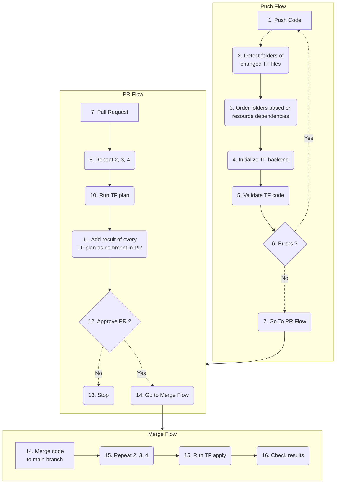

# Sample project of usage Terraform Azure CI/CD with remote backend 

## Description

This asset can be used as a sample of managing Azure resources using CI/CD approach. It's utilizing terraform and github actions. State files are stored in remote backend.

## Procedure

- Workflows on Push/Pull/Merge:
