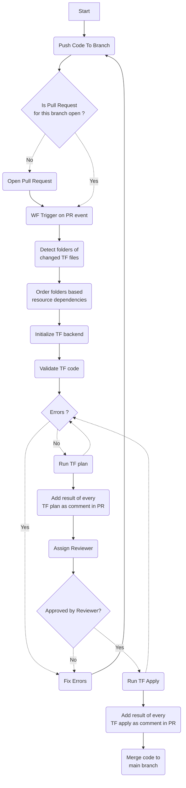

## Automatic CI/CD Workflows (On Pull Request)

```mermaid
flowchart TD
%% https://en.wikipedia.org/wiki/Flowchart
%% https://mermaid.js.org/syntax/flowchart.html

    A0[Start] --> A1(Push Code To Branch)
    A1 --> A2{Is Pull Request\nfor this branch open ?}
    A2 .-> |No| A3(Open Pull Request)
    A3 --> A4(WF Trigger on PR event)
    A2 .-> |Yes| A4
    A4 --> A5(Detect folders of\nchanged TF files)
    A5 --> B6(Order folders based\nresource dependencies)
    B6 --> A6(Initialize TF backend)
    A6 --> A7(Validate TF code)
    A7 --> A8{Errors ?}
    A8 .-> |Yes| A9(Fix Errors)
    A9 --> A1
    A8 .-> |No| A10(Run TF plan)
    A10 .-> A8
    A10 --> A11(Add result of every\nTF plan as comment in PR)
    A11 --> A12(Assign Reviewer)
    A12 --> A13{Approved by Reviewer?}
    A13 .-> |Yes| A14(Run TF Apply)
    A13 .-> |No| A9(Fix Errors)
    A14 .-> A8
    A14 --> A15(Add result of every\nTF apply as comment in PR)
    A15 --> A16(Merge code to\nmain branch)  
```