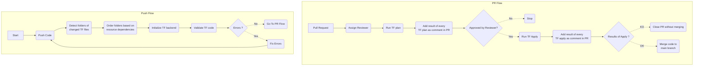

## Automatic CI/CD Workflows (On Push/Pull Request)

```mermaid
flowchart TD
%% https://en.wikipedia.org/wiki/Flowchart
%% https://mermaid.js.org/syntax/flowchart.html

subgraph B["PR Flow"]
    B1[Pull Request] --> B2(Assign Reviewer)
    B2 --> B3(Run TF plan)
    B3 --> B4(Add result of every\nTF plan as comment in PR)
    B4 --> B5{Approved by Reviewer?}
    B5 .-> |No| B6(Stop)
    B5 .-> |Yes| B7(Run TF Apply)
    B7 --> B8(Add result of every\nTF apply as comment in PR)
    B8 --> B9{Results of Apply ?}
    B9 .-> |KO| B11(Close PR without merging)
    B9 .-> |OK| B10(Merge code to\nmain branch)  
end

subgraph A["Push Flow"]
    A0[Start] --> A1(Push Code)
    A1 --> A2(Detect folders of\nchanged TF files)
    A2 --> A3(Order folders based on\nresource dependencies)
    A3 --> A4(Initialize TF backend)
    A4 --> A5(Validate TF code)
    A5 --> A6{Errors ?}
    A6 .-> |No| A8(Go To PR Flow)
    A6 .-> |Yes| A7(Fix Errors)
    A7 --> A1
end
```